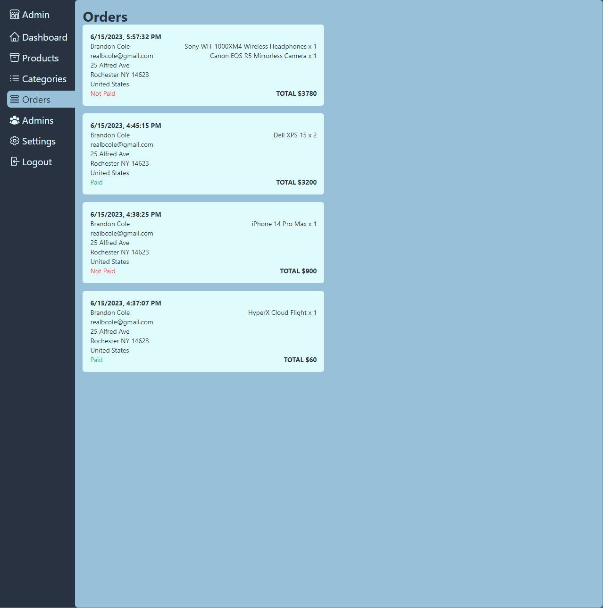

<h3 align="center">Custom Ecommerce Admin Website</h3>

---

 Custom Full Stack Ecommerce Admin Website
      

## NOTE

Due to this app having access to the data displayed in my ecommerce front project (https://github.com/realbcole/ecommerce-front), there is no live demo. Please refer to screenshots and code to learn more about the project.

## 📝 Table of Contents

- [About](#about)
- [Screenshots & Features](#screenshots)
- [Built Using](#built_using)

## 🧐 About 

Full Stack Ecommerce Admin Website, built from scratch, fully functional, fully responsive, connected to my ecommerce front project (https://github.com/realbcole/ecommerce-front)

## Screenshots & Features 

<h3>Features</h3>
<ul>
<li>Shows order data</li>
<li>Shows revenue data</li>
</ul>

<h3>Features</h3>
<ul>
<li>View all products</li>
<li>Create and edit products</li>
<li>Delete products</li>
</ul>

<h3>Features</h3>
<ul>
<li>Create/Edit product details</li>
<li>Add/Remove/Reorder images (uploaded to AWS)</li>
<li>Edit properties based on category</li>
</ul>

<h3>Features</h3>
<ul>
<li>Delete product</li>
</ul>

<h3>Features</h3>
<ul>
<li>View all categories</li>
<li>View number of products in each category</li>
<li>Create/Edit categories</li>
</ul>

<h3>Features</h3>
<ul>
<li>Create/Edit category</li>
<li>Add/remove properties</li>
</ul>

<h3>Features</h3>
<ul>
<li>View all orders</li>
<li>See if order was paid or not</li>
</ul>

<h3>Features</h3>
<ul>
<li>Add/Remove admins</li>
<li>Admins have access to login to this website</li>
</ul>

<h3>Features</h3>
<ul>
<li>Set shop name, will change name from "Ecommerce" on ecommerce front to whatever is set</li>
<li>Set featured product</li>
<li>Add/Remove/Edit Coupons <ul><li>Automatically adds/updates/removes coupons in stripe based on these settings</li><li>Coupons are immediately usable on ecommerce front</li></ul></li>
<li>Set shipping fee</li>
</ul>

## ⛏️ Built Using 

- [React](https://react.dev/) - Web framework
- [NextJS](https://nextjs.org/) - Development framework
- [TypeScript](https://www.typescriptlang.org/) - Language
- [TailwindCSS](https://tailwindcss.com/) - Styling
- [React-Sweetalert2](https://sweetalert2.github.io/recipe-gallery/sweetalert2-react.html) - Alerts
- [Next-Auth](https://next-auth.js.org/) - User authentication
- [Stripe](https://stripe.com/docs) - Financial Services
- [AWS](https://docs.aws.amazon.com/) - Cloud services (for images)
- [NodeJs](https://nodejs.org/en/) - Server Environment
- [Axios](https://axios-http.com/docs/intro) - Backend HTTP Client
- [Mongoose](https://mongoosejs.com/) - Data Modeling
- [MongoDB](https://www.mongodb.com/) - Database
- [Vercel](https://vercel.com/docs) - Deployment
